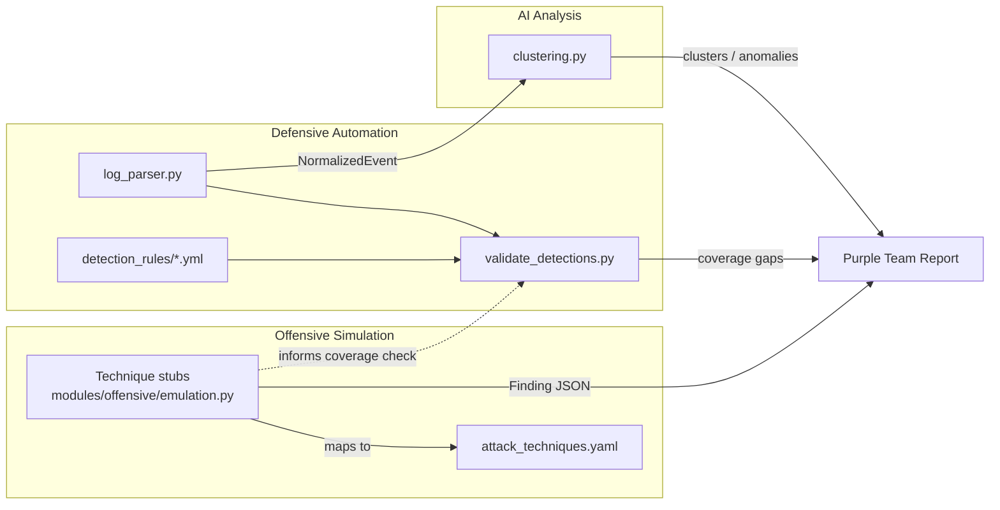

# PTAF Architecture

## Overview

PTAF is organized as three cooperating module groups plus a shared
"Finding" data shape that lets them hand off work to each other:

1. **Offensive simulation** (`modules/offensive/`) produces structured,
   ATT&CK-mapped `Finding` objects from safe, non-destructive simulations.
2. **Defensive automation** (`modules/defensive/`) normalizes real log
   sources into `NormalizedEvent` records, and validates/organizes
   detection rules (Sigma-style YAML) against those findings.
3. **AI analysis** (`modules/ai_analysis/`) clusters and (optionally)
   flags anomalies across normalized events/findings to help an analyst
   prioritize what to look at.

## Data flow



## Why this shape

- **Everything is structured and explainable.** Offensive findings and
  defensive coverage checks are plain data (dataclasses / JSON), not free
  text -- so a report generator, a dashboard, or a different AI model can
  all consume the same output without re-parsing prose.
- **Offensive and defensive are linked by ATT&CK IDs, not by code
  coupling.** `modules/offensive/attack_techniques.yaml` and each Sigma
  rule's `tags:` field are the shared vocabulary; `validate_detections.py`
  uses that to report which techniques currently have no matching
  detection rule.
- **AI analysis is additive, not load-bearing.** `clustering.py` has a
  dependency-free fallback (`cluster_events_naive`) specifically so the
  rest of the pipeline keeps working in environments that don't want an
  ML dependency.

## Directory layout

```
PTAF/
├── install.sh
├── requirements.txt
├── requirements-dev.txt
├── pytest.ini
├── modules/
│   ├── offensive/
│   │   ├── emulation.py         # Technique stubs + Finding shape
│   │   └── attack_techniques.yaml
│   ├── defensive/
│   │   ├── log_parser.py        # Raw logs -> NormalizedEvent
│   │   ├── validate_detections.py
│   │   └── detection_rules/     # Sigma-style YAML rules
│   └── ai_analysis/
│       ├── clustering.py
│       └── config.yaml
├── tests/
│   ├── test_offensive_stub.py
│   └── test_defensive_stub.py
└── docs/
    ├── architecture.md          # this file
    └── example_workflow.md
```

## What's real vs. scaffolding today

This architecture is implemented as far as the *interfaces and safe
examples* go: the Finding/NormalizedEvent shapes, one example technique
per category, one example Sigma rule, a naive+sklearn clustering path, and
a CI pipeline that lints and runs the test suite. It is **not** a claim of
a finished, production SIEM/EDR integration or a trained ML model --
see the top-level README's Status note and CONTRIBUTING.md for how to
extend each piece.
